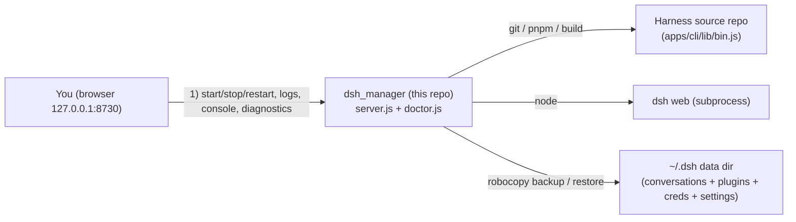

<h1 align="center">
  dsh_manager
</h1>

<p align="center">
  
  
</p>

<p align="center">
  <a href="./README.md"><b>简体中文</b></a> ·
  <a href="./README.en.md">English</a>
</p>

<p align="center">
  <strong>A local web admin console for DeepSeek Harness</strong> &mdash; zero dependencies, no <code>npm install</code>, runs only on your machine.
  One-click pnpm build &amp; hosting of dsh web, update detection &amp; version rollback, <code>~/.dsh</code> backup/restore,
  a built-in diagnostic Doctor, a command console, plus **dependency auto-detection + one-click install + guided setup** made for first-time users.
</p>

> [!NOTE]
> **Primarily Windows-focused.** The launcher and several operations (`start.bat`, `robocopy` backup, `taskkill` process stop) are Windows-based; macOS / Linux can run the core server, but some scripts need adapting.

## Contents

- [What is this?](#what-is-this)
- [Quick start](#quick-start)
- [Feature overview](#feature-overview)
- [Dependency auto-detection &amp; one-click setup](#dependency-auto-detection--one-click-setup)
- [Technical notes](#technical-notes)
- [DSH Diagnostics](#dsh-diagnostics)
- [Command console](#command-console)
- [Security](#security)
- [Development](#development)
- [FAQ](#faq)
- [License &amp; credits](#license--credits)

## What is this?

`dsh_manager` is a **web console scoped to a local DeepSeek Harness** installation. It gathers the operations you
usually scatter across several terminals &mdash; start/stop dsh web, pull and switch versions, back up and restore
`~/.dsh`, run an environment diagnostic, and fire arbitrary `dsh` commands &mdash; into a single page. It has no
third-party runtime dependencies and no separate deployment environment: **just install Node and run.**

> [!IMPORTANT]
> **Not affiliated with DeepSeek.** `dsh_manager` is an independent third-party project with no affiliation,
> endorsement, cooperation or authorization from DeepSeek / DeepSeek AI, and is **not an official DeepSeek Harness
> product**. It merely builds / hosts / backs up / diagnoses the DeepSeek Harness you install yourself on your own
> machine; its development, maintenance and issues are the responsibility of this repository's author. "DeepSeek
> Harness" is a registered trademark of DeepSeek, used here per the DeepSeek Harness brand guidelines (the project
> name adopts the officially recommended "DSH" abbreviation).

> [!CAUTION]
> `dsh_manager` is a **local, personal-use tool**. By default it binds only to `127.0.0.1` &mdash; for safety do not
> rebind to `0.0.0.0` or expose it to the public internet. The project reads/backs up your real data directory `~/.dsh`
> (conversations, plugin configs and credentials). **Never** add `backups/`, `logs/`, `config.json` or `.env`
> to version control (`.gitignore` already ignores them).

## Quick start

1. **Prepare the environment**: dsh_manager itself only depends on **Node.js** (recommended `^22.19.x` or `24.x`).
   After entering the UI, the **"Environment &amp; Dependencies"** card can detect and one-click install pnpm / git.
2. Double-click `start.bat` (or run `node server.js`); the window opens `http://127.0.0.1:8730` automatically; first-time users see a three-step guide.
3. **Prepare the source repo**: if you **already have a dsh source repo**, place the dsh_manager project folder
   **sibling** to the dsh repo folder (both under the same parent folder) and the program auto-discovers it. If you
   **don't have the source yet**, follow the guide and click **"Get Harness source (clone)"** to clone it into the
   sibling location, or set the path manually under **Settings &rarr; repo path**.
4. Back at the top, click **Build Harness**; `apps/cli/lib/bin.js` and the web frontend artifacts will be built.
5. Open **Launch web** on the left and click **Start dsh web**; the browser opens the dsh UI automatically.

> If clicking `start.bat` makes the window flash and disappear (instead of staying in the running state), startup
> failed &mdash; usually a port conflict or an unsatisfied Node version. Press Ctrl+C / read the window error; the
> frontend and backend are unbuilt source, so editing `public/` takes effect on a page refresh.

## Feature overview

| Area | Capability |
| --- | --- |
| One-click web hosting | Manages the dsh web subprocess: start / stop / restart, live logs, detected access URL, port probing against duplicate starts |
| Update detection | `git fetch` official tags from the upstream repo, semver-compare against the current position, prompt when an upgrade is available |
| Version rollback | Pulls official git tags and switches to any historical version with one click (`git checkout` + rebuild) |
| Data backup | Backs up `~/.dsh` to `backups/`; restore / delete / overwrite with retention-limit management; safe pre-restore backup by default |
| One-click build | Runs `pnpm install` + `pnpm build` inside the repo to produce the CLI entry and the web frontend |
| Dependency auto-detection | The overview shows whether node / pnpm / git are ready in real time; when missing, offers "copy command / official download page", or one-click auto-install |
| First-run guide | First launch shows a three-step guide (deps &rarr; source &rarr; build &rarr; launch); dismissing it writes to `config.json` and it won't nag again |
| Diagnostic Doctor | Inlines the full dsh-doctor engine① (env / profile / session / remote check catalog + version hint + dsh_manager self-checks), flutter-doctor style, honest-principle safe repairs |
| Command console | Runs `dsh xxx` from the page with real-time SSE streaming output; whitelist + argv passing, never through a shell |
| Environment check | Detects node / pnpm / git versions and validates that node meets Harness constraints |

## Dependency auto-detection &amp; one-click setup

Made for first-time users whose machine has no environment yet:

1. **Pre-launch check**: `start.bat` checks whether `node` exists; if it's missing it prints a hint and automatically
   opens the official download page.
2. **"Environment &amp; Dependencies" card in the overview**: shows node / pnpm / git status in real time. Each tool has
   a "copy install command" and an "open official download page" action.
3. **Two-tier install (guided by default + optional auto-install)**:
   - **Guided (default)**: only provides copy-pasteable install commands and official links &mdash; never makes decisions
     for you, consistent with the "never modify your environment without permission" principle.
   - **Auto-install (optional)**: clicking "Auto-install missing dependencies" installs via `winget` (node / git)
     and `corepack` (pnpm), streamed live; this may change your system environment (node / git may require admin rights).
   - When the repo is missing, a "Get Harness source (clone)" button appears &mdash; one click `git clone`s the official
     repo and connects it as the repo path.
   - **Build and run**: to build, just click **"Build Harness"** at the top.

## Technical notes

`dsh_manager` only manages and orchestrates. Technical architecture diagram:



- The **Harness source repo** and this project are **two independent git repositories** (file-location note: place
  the two repos in the same (sibling) folder).
- Upgrade/rollback only changes the source version and rebuilds, **preserving** `~/.dsh`; all interactive data lives
  in `~/.dsh`, so switching Harness versions does not affect your conversations or config.
- dsh is a **pnpm workspace monorepo**; the whole "install &rarr; build &rarr; run web" chain relies on pnpm:
  `pnpm install` (all workspace deps) &rarr; `pnpm build` (produce `apps/cli/lib/bin.js` and `apps/web/dist`) &rarr; `pnpm dsh web`.
  The UI's "Build" equals the first two steps; "Start dsh web" runs the built artifact with node directly (equivalent to
  `pnpm dsh web`, skipping the pnpm shim). You can also switch to `source` mode in **Settings** and run
  `node --import tsx/esm apps/cli/src/bin.ts` straight from the TS source, handy for debugging.
- `apps/cli` (CLI) and `apps/web` (built-in web) live in the same workspace: shared dependencies, unified commands, no
  extra install &mdash; another "zero extra deployment" on top of the zero-dep `dsh_manager` itself.

## DSH Diagnostics

The built-in **System Diagnostics inlines and rewrites** the community dsh-doctor's full diagnostic engine
**into `doctor.js`** (no external file linking), running by its three-layer design with a flutter-doctor style
report (`✓ ok / ! warn / ✗ error`):

- **Layer A built-in checks:** `env` (node / pnpm / zstd / node-pty / storage JSON / dsh-session anchors / port 3080),
  `profile` (bundle resolution / id conflicts / insert names / file: deps / top-level duplicates / patch structure /
  adapter conflicts / settings injection / main entries / declared bins, etc.),
  `session` (zstd container frame count / orphan tool_call / unclosed turns / seq continuity / sourceEventSeqs /
  unknown event types / end-seed replay / full-session scan).
- **Layer A remote check catalog:** declarative read-only probe rules (bundled copy + remote refresh every 6h;
  new checks take effect without reinstalling).
- **Layer B version hint:** compares the ported version against the dsh-doctor upstream; hints only, never auto-updates.
- **dsh_manager self-checks:** presence and source chain of the `DEEPSEEK_API_KEY` credential
  (process env &rarr; cwd/.env &rarr; `~/.dsh/.env` &rarr; provider credential store; **existence only, never echoes the value**),
  `settings.yaml`, web.log, repository-plugin install traces and repo git state.
- **Honest repair principle:** when `settings` is missing/corrupt it backs up then writes a minimal valid config;
  credentials are written to `~/.dsh/.env` only after you type them in; everything else emits precise,
  copy-pasteable commands and does **not** modify your environment without permission.

<sup>① Diagnostic engine written from [`moonquake2004/dsh-doctor`](https://github.com/moonquake2004/dsh-doctor)
(MIT License). The diagnostic framework of the dsh_manager self-checks (report structure, the
`fixSettings`/`fixCredentials` repair helpers, etc.) derives from this project's earlier port of
[`coppynight/dsh-doctor`](https://github.com/coppynight/dsh-doctor) (BSD-3-Clause, &copy; `dsh-external`);
the credential source chain incl. the provider credential store is a dsh_manager **own enhancement**, not
coppynight's original logic. Both original copyright and license texts are retained at the end of `doctor.js`.</sup>

## Command console

An embedded **Command Console** page for running `dsh` commands with real-time streaming output:

- Only accepts commands starting with `dsh`, e.g. `dsh doctor`, `dsh --help`, `dsh web`.
- Arguments are passed **directly as argv** (never through a shell), so non-`dsh` commands such as `rm -rf /` are
  rejected outright &mdash; no injection risk.
- Only one command runs at a time; you can **stop** it any time (taskkill the whole process tree on Windows).
- Completed output stays in the terminal box for easy review.

## Security

- The server binds only to `127.0.0.1`; all commands are assembled from fixed internal commands and validated
  arguments to avoid injection.
- Console commands are restricted to the `dsh` prefix and passed as argv, never through a shell.
- Dependency "auto-install" runs only after you click it and uses trusted package managers (winget / corepack); guided mode stays the default.
- `.gitignore` ignores `backups/` (real `~/.dsh` data), `logs/`, `config.json` (machine-specific paths), `.env`,
  keys and editor temp files; **do not `git add -f`** them.
- This is a local personal tool &mdash; be careful with restore / rollback / delete-backup actions; they all ask for
  confirmation by default.
- This project is an open-source **BSD 3-Clause** project for learning purposes only. The code repository is provided
  as-is, with no express or implied warranties about its quality; the project is not responsible for any loss caused by its use.

## Development

This project is itself zero-dependency; changes take effect immediately:

```bash
cd dsh_manager          # go to the folder you cloned/unzipped
node server.js          # start the admin UI, browser opens http://127.0.0.1:8730
```

- Backend: `server.js` (HTTP + REST + SSE + subprocess management + console exec), `doctor.js` (diagnostics & repair).
- Frontend: `public/index.html`, `public/app.js`, `public/style.css` (no build step; changes apply directly).
- This directory is an initialized git repository; commit as needed and keep `.gitignore` effective.

## FAQ

| Symptom | Handling |
| --- | --- |
| Port already in use | The manager auto-switches to the next port; dsh web port is `webPort` under **Settings** (0 = auto) |
| node version warning | Harness requires `node ^22.19.x` or `24.x`; lower versions cause build failures; use the dependency card to copy a command / auto-install |
| Cannot fetch versions | Check GitHub connectivity and that the repo has the official remote configured ("Add official remote" under **Versions / Rollback**) |
| `start.bat` flashes out | Usually a port conflict or node version mismatch; check Ctrl+C / window error |
| "uncommitted changes" on upgrade/rollback | Harness working tree is dirty; it aborts and asks you to commit or restore first |
| Want to fully clear data | Manage `~/.dsh` via **Backup / Restore**; do not delete the source directory by hand |

## License &amp; credits

- This project is released under the **BSD-3-Clause** license (&copy; `NormalTable5801`, 2026);
  see the root [`LICENSE`](LICENSE) for the full terms.
- Its **Diagnostic Doctor's engine** is written from
  [`moonquake2004/dsh-doctor`](https://github.com/moonquake2004/dsh-doctor) (MIT License, &copy; `moonquake2004`).
  To satisfy the MIT license, `doctor.js` names the source at the top and retains its license text at the end.
- Its **dsh_manager self-checks** derive from this project's earlier port of
  [`coppynight/dsh-doctor`](https://github.com/coppynight/dsh-doctor) (BSD-3-Clause, &copy; `dsh-external`);
  the credential source chain (provider credential store) is a dsh_manager **own enhancement**.
  To satisfy clause 1 of BSD-3 for source redistribution, `doctor.js` also retains the **full original copyright
  notice, terms and disclaimer** at the end.
- **DSH** is an abbreviation for [DeepSeek Harness](https://github.com/deepseek-ai/deepseek-harness.git).
