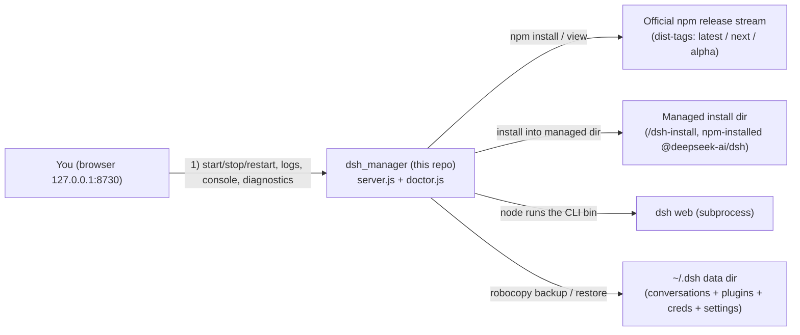

<h1 align="center">
  dsh_manager
</h1>

<p align="center">
  
  
</p>

<p align="center">
  <a href="./README.md"><b>简体中文</b></a> ·
  <a href="./README.en.md">English</a>
</p>

<p align="center">
  <strong>A local web admin console for DeepSeek Harness</strong> &mdash; zero dependencies, no <code>npm install</code>, runs only on your machine.
  One-click install / update of Harness (official npm release stream) &amp; hosting of dsh web, update detection &amp; version rollback, <code>~/.dsh</code> backup/restore,
  a built-in diagnostic Doctor, a command console, plus **dependency auto-detection + one-click install + guided setup** made for first-time users.
</p>

> \[!NOTE]
> **Primarily Windows-focused.** The launcher and several operations (`start.bat`, `robocopy` backup, `taskkill` process stop) are Windows-based; macOS / Linux can run the core server, but some scripts need adapting.

## Contents

- [What is this?](#what-is-this)

- [Quick start](#quick-start)

- [Feature overview](#feature-overview)

- [Dependency auto-detection & one-click setup](#dependency-auto-detection--one-click-setup)

- [Technical notes](#technical-notes)

- [DSH Diagnostics](#dsh-diagnostics)

- [Command console](#command-console)

- [Security](#security)

- [Development](#development)

- [FAQ](#faq)

- [License & credits](#license--credits)

## What is this?

`dsh_manager` is a **web console scoped to a local DeepSeek Harness** installation. It gathers the operations you
usually scatter across several terminals — start/stop dsh web, pull and switch versions, back up and restore
`~/.dsh`, run an environment diagnostic, and fire arbitrary `dsh` commands — into a single page. It has no
third-party runtime dependencies and no separate deployment environment: **just install Node and run.**

> \[!IMPORTANT]
> **Not affiliated with DeepSeek.** `dsh_manager` is an independent third-party project with no affiliation,
> endorsement, cooperation or authorization from DeepSeek / DeepSeek AI, and is **not an official DeepSeek Harness
> product**. It merely installs / hosts / backs up / diagnoses the DeepSeek Harness you install yourself on your own
> machine; its development, maintenance and issues are the responsibility of this repository's author. "DeepSeek
> Harness" is a registered trademark of DeepSeek, used here per the DeepSeek Harness brand guidelines (the project
> name adopts the officially recommended "DSH" abbreviation).

> \[!CAUTION]
> `dsh_manager` is a **local, personal-use tool**. By default it binds only to `127.0.0.1` — for safety do not
> rebind to `0.0.0.0` or expose it to the public internet. The project reads/backs up your real data directory `~/.dsh`
> (conversations, plugin configs and credentials). **Never** add `backups/`, `logs/`, `config.json` or `.env`
> to version control (`.gitignore` already ignores them).

## Quick start

1. **Prepare the environment**: dsh\_manager itself only depends on **Node.js** (recommended `^22.19.x` or `24.x`) +
   **npm** (bundled with Node). The "Environment & Dependencies" card in the UI detects whether it's ready.
2. Double-click `start.bat` (or run `node server.js`); the window opens `http://127.0.0.1:8730` automatically; first-time users see a three-step guide.
3. **Install Harness**: click **Install / Update Harness** (or the matching button in the first-run guide). The backend
   installs the latest version from the official npm release stream `@deepseek-ai/dsh` into the managed directory
   (default `<manager>/dsh-install`). The version and its bundled toolchain are pre-built by the publisher, so
   **no local pnpm / git or a C++ compiler is needed**.
4. Open **Launch web** on the left and click **Start dsh web**; the browser opens the dsh UI automatically.

> If clicking `start.bat` makes the window flash and disappear (instead of staying in the running state), startup
> failed — usually a port conflict or an unsatisfied Node version. Press Ctrl+C / read the window error; the
> frontend and backend are unbuilt source, so editing `public/` takes effect on a page refresh.

## Feature overview

| Area                       | Capability                                                                                                                                                                              |
| -------------------------- | --------------------------------------------------------------------------------------------------------------------------------------------------------------------------------------- |
| One-click web hosting      | Manages the dsh web subprocess: start / stop / restart, live logs, detected access URL, port probing against duplicate starts                                                           |
| Update detection           | Reads dist-tags (latest / next / alpha) and published versions from the official npm release stream, semver-compares against the current position, prompts when an upgrade is available |
| Version rollback           | Lists official npm historical versions and installs/switches to any version in the managed directory with one click                                                                     |
| Data backup                | Backs up `~/.dsh` to `backups/`; restore / delete / overwrite with retention-limit management; safe pre-restore backup by default                                                       |
| One-click install / update | Installs the target channel's latest version from the official npm release stream (upgrades & rollbacks included); no local build toolchain needed                                      |
| Dependency auto-detection  | The overview shows whether node / npm are ready in real time; when missing, offers "copy command / official download page", or one-click auto-install                                   |
| First-run guide            | First launch shows a three-step guide (deps → install → launch); dismissing it writes to `config.json` and it won't nag again                                                           |
| Diagnostic Doctor          | Inlines the full dsh-doctor engine① (env / profile / session / remote check catalog + version hint + dsh\_manager self-checks), flutter-doctor style, honest-principle safe repairs     |
| Command console            | Runs `dsh xxx` from the page with real-time SSE streaming output; whitelist + argv passing, never through a shell                                                                       |
| Environment check          | Detects node / npm versions and validates that node meets Harness constraints                                                                                                           |

## Dependency auto-detection & one-click setup

Made for first-time users whose machine has no environment yet:

1. **Pre-launch check**: `start.bat` checks whether `node` exists; if it's missing it prints a hint and automatically
   opens the official download page.
2. **"Environment & Dependencies" card in the overview**: shows node / npm status in real time, with a "copy install
   command" and an "open official download page" action for the missing one.
3. **Install Harness (npm release stream)**: click **Install / Update Harness** to run
   `npm install --prefix <installDir> @deepseek-ai/dsh@<version>` from the managed directory, resolving the target version
   from the current channel (latest / next / alpha). The version and its bundled toolchain are pre-built by the publisher,
   so **no pnpm / git / compiler is needed**.
4. Upgrade / rollback work the same way, installing a specific version; a `~/.dsh` backup is taken by default first.

## Technical notes

`dsh_manager` only manages and orchestrates. Technical architecture diagram:



- **Install management**: Harness is installed as the official npm package `@deepseek-ai/dsh` into a directory that
  dsh\_manager itself manages (default `<manager>/dsh-install`), fully separate from and independent of `~/.dsh`.

- Upgrade/rollback only switches the managed package to the target version, **preserving** `~/.dsh`; all interactive
  data lives in `~/.dsh`, so switching Harness versions does not affect your conversations or config.

- Versions are tracked via **npm dist-tags** (latest / next / alpha). "Start dsh web" runs the managed install's CLI bin
  entry with node directly (equivalent to `dsh web`), skipping the pnpm shim.

- dsh's own dependencies and bundled binary toolchain are pre-built by the publisher, so **no pnpm / git / C++ compiler
  is needed** locally to install and run.

## DSH Diagnostics

The built-in **System Diagnostics inlines and rewrites** the community dsh-doctor's full diagnostic engine
**into** **`doctor.js`** (no external file linking), running by its three-layer design with a flutter-doctor style
report (`✓ ok / ! warn / ✗ error`):

- **Layer A built-in checks:** `env` (node / pnpm / zstd / node-pty / storage JSON / dsh-session anchors / port 3080),
  `profile` (bundle resolution / id conflicts / insert names / file: deps / top-level duplicates / patch structure /
  adapter conflicts / settings injection / main entries / declared bins, etc.),
  `session` (zstd container frame count / orphan tool\_call / unclosed turns / seq continuity / sourceEventSeqs /
  unknown event types / end-seed replay / full-session scan).

- **Layer A remote check catalog:** declarative read-only probe rules (bundled copy + remote refresh every 6h;
  new checks take effect without reinstalling).

- **Layer B version hint:** compares the ported version against the dsh-doctor upstream; hints only, never auto-updates.

<sup>① Diagnostic engine written from [`moonquake2004/dsh-doctor`](https://github.com/moonquake2004/dsh-doctor)
(MIT License). Its original copyright and license texts are retained at the end of `doctor.js`.</sup>

## Command console

An embedded **Command Console** page for running `dsh` commands with real-time streaming output:

- Only accepts commands starting with `dsh`, e.g. `dsh doctor`, `dsh --help`, `dsh web`.

- Arguments are passed **directly as argv** (never through a shell), so non-`dsh` commands such as `rm -rf /` are
  rejected outright — no injection risk.

- Only one command runs at a time; you can **stop** it any time (taskkill the whole process tree on Windows).

- Completed output stays in the terminal box for easy review.

## Security

- The server binds only to `127.0.0.1`; all commands are assembled from fixed internal commands and validated
  arguments to avoid injection.

- Console commands are restricted to the `dsh` prefix and passed as argv, never through a shell.

- Dependency "auto-install" runs only after you click it and uses a trusted package manager (winget for Node); guided mode stays the default.

- The managed install dir `<manager>/dsh-install` and `logs/`, `config.json` (absolute machine-specific paths) are all
  treated as regenerable/local-sensitive. `.gitignore` ignores `backups/` (real `~/.dsh` data), `logs/`, `config.json`,
  `.env`, keys and editor temp files; **do not** **`git add -f`** them.

- This is a local personal tool — be careful with restore / rollback / delete-backup actions; they all ask for
  confirmation by default.

- This project is an open-source **BSD 3-Clause** project for learning purposes only. The code repository is provided
  as-is, with no express or implied warranties about its quality; the project is not responsible for any loss caused by its use.

## Development

This project is itself zero-dependency; changes take effect immediately:

```bash
cd dsh_manager          # go to the folder you cloned/unzipped
node server.js          # start the admin UI, browser opens http://127.0.0.1:8730
```

- Backend: `server.js` (HTTP + REST + SSE + subprocess management + console exec), `doctor.js` (diagnostics & repair).

- Frontend: `public/index.html`, `public/app.js`, `public/style.css` (no build step; changes apply directly).

- This directory is an initialized git repository; commit as needed and keep `.gitignore` effective.

## FAQ

| Symptom                       | Handling                                                                                                                                    |
| ----------------------------- | ------------------------------------------------------------------------------------------------------------------------------------------- |
| Port already in use           | The manager auto-switches to the next port; dsh web port is `webPort` under **Settings** (0 = auto)                                         |
| node version warning          | Harness requires `node ^22.19.x` or `24.x`; lower versions cause install failures; use the dependency card to copy a command / auto-install |
| Cannot fetch / check versions | Confirm the network can reach the npm registry (registry.npmjs.org) and access the official release stream `@deepseek-ai/dsh`               |
| Install / update fails        | Usually a network or npm-registry issue; check the npm install log on the **Updates** page to locate the cause, then retry                  |
| `start.bat` flashes out       | Usually a port conflict or node version mismatch; check Ctrl+C / window error                                                               |
| Want to fully clear data      | Manage `~/.dsh` via **Backup / Restore**; to reinstall Harness, delete the managed dir `dsh-install` and install again                      |

## License & credits

- This project is released under the **BSD-3-Clause** license (© `NormalTable5801`, 2026);
  see the root [`LICENSE`](LICENSE) for the full terms.

- Its **Diagnostic Doctor's engine** is written from
  [`moonquake2004/dsh-doctor`](https://github.com/moonquake2004/dsh-doctor) (MIT License, © `moonquake2004`).
  To satisfy the MIT license, `doctor.js` names the source at the top and retains its license text at the end.

- **DSH** is an abbreviation for [DeepSeek Harness](https://github.com/deepseek-ai/deepseek-harness.git).

