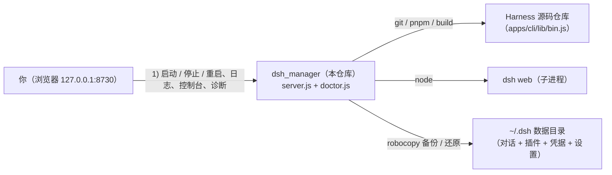

<h1 align="center">
  dsh_manager
</h1>

<p align="center">
  
  
</p>

<p align="center">
  <a href="./README.md"><b>简体中文</b></a> ·
  <a href="./README.en.md">English</a>
</p>

<p align="center">
  <strong>DeepSeek Harness 的本地 Web 管理台</strong> —— 零依赖、无需 <code>npm install</code>，仅本机运行。
  一键 pnpm 构建与托管 dsh web、检测更新与版本回滚、<code>~/.dsh</code> 数据备份还原、
  内置诊断 Doctor、命令控制台，以及专为新人的「依赖自动检测 + 一键安装 + 引导」。
</p>

> [!NOTE]
> **当前主要面向 Windows。** 启动脚本与若干操作（`start.bat`、`robocopy` 备份、`taskkill` 停止进程）基于 Windows；macOS / Linux 可运行核心服务，但部分脚本需自行适配。

## 目录

- [这是什么？](#这是什么)
- [快速开始](#快速开始)
- [功能总览](#功能总览)
- [新人依赖自动检测与一键安装](#新人依赖自动检测与一键安装)
- [运行链路 / 数据分离](#运行链路--数据分离)
- [诊断 Doctor](#诊断-doctor)
- [命令控制台](#命令控制台)
- [安全说明](#安全说明)
- [开发与构建](#开发与构建)
- [常见问题](#常见问题)
- [许可与致谢](#许可与致谢)

## 这是什么？

`dsh_manager` 是一个**仅针对本机 DeepSeek Harness** 的 Web 管理界面：把「启动 / 停止 dsh web、拉取并切换版本、
备份还原 `~/.dsh`、跑一遍环境诊断、随手敲几条 `dsh` 命令」这些散落在多个终端里的操作，收进一个页面。
它没有任何第三方运行时依赖，也没有独立的部署环境要求——**装好 Node 就能跑。**

> [!IMPORTANT]
> **与 DeepSeek 无关。** `dsh_manager` 是独立的第三方项目，与 DeepSeek / DeepSeek AI 无隶属、合作、背书或授权关系，**不是 DeepSeek Harness 的官方产物**。它仅在本机便捷地构建 / 托管 / 备份 / 诊断你自行安装的 DeepSeek Harness；「DeepSeek Harness」为 DeepSeek 的注册商标，本工具按 DeepSeek Harness 品牌指南使用该名称（项目名采用官方推荐的「DSH」缩写）。

> [!CAUTION]
> `dsh_manager` 是**本机自用工具**，默认只绑定 `127.0.0.1`，为了安全请勿改绑 `0.0.0.0` 或暴露到公网。
> 该项目读取 / 备份你的真实数据目录 `~/.dsh`（含对话、插件配置与凭据），**请勿**把 `backups/`、`logs/`、
> `config.json`、`.env` 加入版本控制（`.gitignore` 已默认忽略）。

## 快速开始

1. **准备环境**：dsh_manager 本身只依赖 **Node.js**（推荐 `^22.19.x` 或 `24.x`）。进入界面后到「环境与依赖」卡片可检测并一键安装pnpm/git。
2. 双击 `start.bat`（或运行 `node server.js`），窗口会自动打开 `http://127.0.0.1:8730`；首次进入会显示三步引导。
3. **准备源码仓库**：如果你**已有 dsh 源码仓库**，把 dsh_manager 这个项目文件夹放到与 dsh 仓库总文件夹**同级**的位置（两者在同一个父文件夹下），程序会自动发现它；**还没有源码**，就按引导点「获取 Harness 源码（clone）」一键克隆到同级位置，或在「其它设置 → 仓库路径」手动填写路径。
4. 回到顶部点「构建 Harness」， `apps/cli/lib/bin.js` 与 web 前端产物将会被构建。
5. 左侧进「启动 web」，点「启动 dsh web」，浏览器会自动弹出 dsh 界面。

> 若点击 `start.bat` 后窗口一闪而过（而非停留在服务运行态），说明启动失败——多为端口被占用或 node 版本不符。
> 此时按 Ctrl+C / 查看窗口报错即可；前端与后端均为无构建源码，改 `public/` 后刷新页面即可生效。

## 功能总览

| 场景 | 能力 |
| --- | --- |
| 一键启动 web | 托管 dsh web 子进程：启动 / 停止 / 重启、实时日志、识别访问地址、探活端口防重复启动 |
| 更新检测 | 从官方仓库 `git fetch` 拉取 tag、以 semver 对比当前位置、提示可升级版本 |
| 版本回滚 | 拉取官方 git tags，一键切换到任意历史版本（`git checkout` + 重新构建） |
| 数据备份 | 把 `~/.dsh` 备份到 `backups/`，可还原 / 删除 / 覆盖，保留上限管理；还原前默认安全性备份 |
| 一键构建 | 在仓库内执行 `pnpm install` + `pnpm build`，产出 CLI 入口与 web 前端 |
| 依赖自动检测 | 状态总览实时显示 node / pnpm / git 是否就绪；缺失时给出「复制命令 / 官方下载页」，也可一键自动安装 |
| 新人引导 | 首次运行显示三步引导（依赖 → 取源码 → 构建 → 启动），关闭后写入 config.json 不再打扰 |
| 诊断 Doctor | 纯融入 dsh-doctor 完整诊断引擎①（env / profile / session / 远程检查目录 + 版本提示 + dsh_manager 自检），flutter-doctor 风格，诚实原则安全修复 |
| 命令控制台 | 页面内执行 `dsh xxx`，输出经 SSE 实时回显；白名单 + argv 传入，不经 shell |
| 环境检查 | 检测 node / pnpm / git 及版本，校验 node 是否满足 Harness 约束并给出版本指引 |

## 依赖自动检测与一键安装

针对「第一次用、机器上还没有环境」：

1. **启动前预检**：`start.bat` 先检查 `node` 是否存在，缺失则给出提示并自动打开官方下载页，
2. **状态总览里的「环境与依赖」卡片**：实时显示 node / pnpm / git 三项状态。每个工具都带
   「复制安装命令」和「打开官方下载页」。
3. **双档安装（默认引导式 + 可选自动装）**：
   - **引导式（默认）**：只给出可复制的安装命令与官方链接，绝不替你做决定，契合"不越权改动环境"原则。
   - **自动安装（可选）**：点「自动安装缺失依赖」后，用 `winget`（node / git）与 `corepack`（pnpm）
     自动安装，输出实时回显；可能改动系统环境（node / git 可能需要管理员权限）。
   - 仓库缺失时出现「获取 Harness 源码（clone）」按钮，一键 `git clone` 官方仓库并联接为仓库路径
   - **构建和运行**，构建请直接在顶部点击 **「构建 Harness」**。

## 技术说明

`dsh_manager` 只做「托管与调度」，技术原理图：



- **Harness 源码仓库**与本项目是**两个独立的 git 仓库**（文件位置说明：两个仓库放在同级目录）。

- 升级 / 回滚只改源码版本并重新构建，保留 `~/.dsh`；所有交互数据都在 `~/.dsh`，
  因此切换 Harness 版本不影响你的对话与配置。
- dsh 是一个 **pnpm workspace 单仓（monorepo）**，「装依赖 → 构建 → 起 web」整条链路依赖 pnpm：
  `pnpm install`（装齐各 workspace 依赖）→ `pnpm build`（产出 `apps/cli/lib/bin.js` 与 `apps/web/dist`）→ `pnpm dsh web`。
  界面上的「构建」等同于前两步；「启动 dsh web」直接以 node 运行构建产物（等价于 `pnpm dsh web`，略过 pnpm shim）。
  也可在「其它设置」切到 `source` 模式，用 `node --import tsx/esm apps/cli/src/bin.ts` 直接跑 tsx 源码，适合调试。
- `apps/cli`（CLI）与 `apps/web`（内置 web）位于同一工作区，依赖复用、命令统一——这是"零依赖的 dsh_manager"之外，又一重"零额外部署"。

## DSH诊断 

内置的「系统诊断」把社区 dsh-doctor 的完整诊断引擎**融入、重写进 `doctor.js`**，
按其三层设计运行，采用 flutter-doctor 风格报告（`✓ 通过 / ! 关注 / ✗ 阻断`）：

- **Layer A 内置检查**：`env`（node / pnpm / zstd / node-pty / 存储 JSON / dsh-session 锚点 / 端口 3080）、
  `profile`（bundle 解析 / id 冲突 / insert 名 / file: 依赖 / 顶层重复 / patch 结构 / adapter 冲突 /
  settings 注入 / main 入口 / bin 可执行 等）、`session`（zstd 容器帧数 / 孤儿 tool_call / 未闭合 turn /
  seq 连续 / sourceEventSeqs / 未知事件类型 / end-seed 重放 / 全会话扫描）。
- **Layer A 远程检查目录（catalog）**：声明式只读探测规则（内置副本 + 每 6h 拉取远端，可动态增新检查，无需重装）。
- **Layer B 版本提示**：对比本端口版本与 dsh-doctor 上游版本，仅提示、不自动更新。
- **dsh_manager 自检**：凭据 `DEEPSEEK_API_KEY` 存在性与来源链（进程环境 → cwd/.env → `~/.dsh/.env` →
  provider 凭据存储，**只判存在性、绝不回显值**）、`settings.yaml`、web.log、repository 插件安装痕迹、仓库 git 状态。
- **诚信原则修复**：settings 缺失 / 损坏时先备份再写入最小合法配置；凭据由你手动输入后写入 `~/.dsh/.env`；
  其余问题只输出可直接复制的精确命令，**不越权改动**你的环境。

<sup>① 诊断引擎改写自社区同名项目 [`moonquake2004/dsh-doctor`](https://github.com/moonquake2004/dsh-doctor)（MIT License）。
其 dsh_manager 自检的诊断框架（report 结构、`fixSettings`/`fixCredentials` 修复助手等）衍生自本项目先期移植自
[`coppynight/dsh-doctor`](https://github.com/coppynight/dsh-doctor)（BSD-3-Clause，版权 `dsh-external`）的实现；
其中凭据来源链含 provider 凭据存储层属 dsh_manager **自有增强**，非 coppynight 原样逻辑。两份原版权与许可全文均保留在 `doctor.js` 末尾。</sup>

## 命令控制台

页面内嵌一个「控制台 Console」，用于执行 `dsh` 命令并把输出实时流式回显：

- 只接受 `dsh` 开头的命令，例如 `dsh doctor`、`dsh --help`、`dsh web`。
- 参数**直接作为 argv 传入**（不经 shell），因此形如 `rm -rf /` 的非 `dsh` 命令会被直接拒绝，规避注入。
- 一次只允许一条命令在运行；可随时「停止」（在 Windows 下 taskkill 整棵进程树）。
- 完成后保留在终端框内，便于回看历史输出。

## 安全说明

- 服务仅绑定 `127.0.0.1`；所有命令均由内部固定命令和校验过的参数拼接而成，避免注入。
- 控制台命令限定 `dsh` 前缀并以 argv 传入，不经过 shell。
- 依赖「自动安装」需点击后才执行，且使用可信包管理器（winget / corepack），默认仍以引导式为主。
- `.gitignore` 已忽略 `backups/`（含真实 `~/.dsh` 数据）、`logs/`、`config.json`（本机路径）、`.env`、
  密钥与编辑器临时文件；**请勿 `git add -f` 强制提交**。
- 本工具用于本机自用，请谨慎执行还原 / 回滚 / 删除备份等动作——它们默认都有二次确认。
- 本项目为BSD 3-Clause开源项目，仅供学习，代码仓库原样提供，对项目质量不提供明示/暗示的保证，使用造成损失本项目概不负责。

## 开发与构建

本项目自身零依赖，改动即生效：

```bash
cd dsh_manager          # 切换到你克隆或解压的目录
node server.js          # 启动管理界面，浏览器打开 http://127.0.0.1:8730
```

- 后端：`server.js`（HTTP + REST + SSE + 子进程托管 + 控制台执行）、`doctor.js`（诊断与修复）。
- 前端：`public/index.html`、`public/app.js`、`public/style.css`（无构建，直接生效）。
- 本目录是一个已初始化的 git 仓库；改动后按需提交，注意保持 `.gitignore` 生效。

## 常见问题

| 现象 | 处理 |
| --- | --- |
| 端口被占用 | manager 自动改用下一个端口；dsh web 端口在「其它设置」`webPort`（0 = 自动） |
| node 版本告警 | Harness 要求 `node ^22.19.x` 或 `24.x`，不足会导致构建失败；可用依赖卡片复制命令 / 一键装 |
| 拉取不到版本 | 确认网络可达 GitHub，且仓库已配置官方 remote（未配置可在「版本 / 回滚」点「添加官方 remote」） |
| `start.bat` 闪退 | 多为端口占用或 node 版本不符；按 Ctrl+C / 看窗口报错 |
| 升级 / 回滚提示有未提交改动 | 说明 Harness 仓库工作区不干净，会中止并提示：先提交或还原后再切换版本 |
| 想彻底清数据 | 用「备份 / 还原」管理 `~/.dsh`，不要直接手删源码目录 |


## 许可与致谢

- 本项目以 **BSD-3-Clause** 许可证发布（版权 `NormalTable5801`，2026），完整条款见根目录 [`LICENSE`](LICENSE)。
- 其「诊断 Doctor」的**诊断引擎**改写自
  [`moonquake2004/dsh-doctor`](https://github.com/moonquake2004/dsh-doctor)（MIT License，版权 `moonquake2004`）。
  为符合 MIT 许可证要求，`doctor.js` 顶部标注来源、末尾保留其许可证全文。
- 其「dsh_manager 自检」的诊断框架衍生自先期移植自
  [`coppynight/dsh-doctor`](https://github.com/coppynight/dsh-doctor)（BSD-3-Clause，版权 `dsh-external`）的实现；
  凭据来源链（provider 凭据存储层）为 dsh_manager **自有增强**。
  为符合 BSD-3 第 1 条源码再分发要求，`doctor.js` 末尾一并保留**原版权声明 + 条款 + 免责声明全文**。
- DSH是 [DeepSeek Harness](https://github.com/deepseek-ai/deepseek-harness.git) 的缩写。